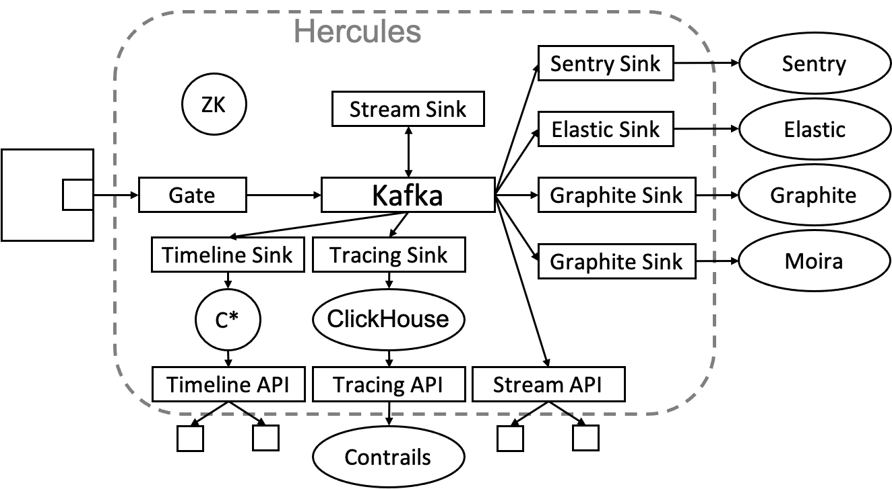

[](https://travis-ci.com/vostok/hercules)

# Vostok Hercules
Vostok Hercules is an open-source distributed system
based on Apache Kafka and used for reliable delivery of telemetry data from microservices
to storage and analytics engines.

Vostok Hercules is developed by [Kontur](https://github.com/skbkontur) as a part of Vostok project —
an ecosystem for easy and fast development of microservices primarily using .NET Core / C#.

Vostok Hercules provides abstractions for application code
to encapsulate specific data format in telemetry engines depending on a telemetry type.
Vostok Hercules provides out of the box 4 telemetry types:
* logs,
* metrics,
* distributed traces,
* annotations.

## Telemetry types
Telemetry is an event which has a timestamp and tags.
Set of tags depends on a [telemetry type](doc/event-schema/README.md).

### Logs
Vostok Hercules delivers logs to ElasticSearch.
Also, logs with level `ERROR` or `FATAL` are delivered to [Sentry](https://github.com/getsentry/sentry).
See supported [log event schema](doc/event-schema/log-event-schema.md) for details.

### Metrics
Vostok Hercules delivers metrics to Graphite, [Moira](https://github.com/moira-alert)
or any other tool which supports Graphite format.
Metrics can be in [the plaintext format](https://graphite.readthedocs.io/en/stable/feeding-carbon.html#the-plaintext-protocol),
when a metric name consists of several components joined by a dot
or in the modern [tagged format](https://graphite.readthedocs.io/en/stable/tags.html).
See supported [metric event schema](doc/event-schema/metric-event-schema.md) for details.

### Distributed traces
Vostok Hercules stores distributed traces into ClickHouse.
To analyze traces use [Contrails](https://github.com/vostok/contrails.web) web interface.
Contrails is a tool for tree span analysis.
See supported [trace span schema](doc/event-schema/trace-span-schema.md) for details.

### Annotations
Annotation marks point on graphs in Grafana and Kibana.
Vostok Hercules delivers annotations to ElasticSearch.
See supported [annotation event schema](doc/event-schema/annotation-event-schema.md) for details.

### Other telemetry
Vostok Hercules supports an extendable processing of telemetry events and custom telemetry types as well.
Hercules can be extended by one of the following ways:
* Use one of provided Sinks (e.g. see [Elastic Sink](hercules-elastic-sink/README.md)),
* Write an integration via universal HTTP [Stream API](hercules-stream-api/README.md) or [Timeline API](hercules-timeline-api/README.md) in any language you prefer,
* Write a new Sink in Java.

## System Design


Minimal data unit of Vostok Hercules is an `Event`.
Events do not have predefined schema except well-known tags in [some cases](doc/event-schema/README.md).
To support schemaless processing Vostok Hercules stores and transfers events
in the binary format with a self-described schema (see [Hercules Protocol](hercules-protocol/README.md)).

A `Stream` is a collection of events of the same type.
Each stream has a backing topic in Apache Kafka.

An application uses [hercules client](https://github.com/vostok/hercules.client)
to write events to [Gate](hercules-gate/README.md) into streams.
Other applications can read these events from [Stream API](hercules-stream-api/README.md)
or [Timeline API](hercules-timeline-api/README.md) using the same client.

Various sink daemons can deliver events to various backends at the same time.
List of supported sink daemons:
* [Elastic Sink](hercules-elastic-sink/README.md) delivers events to ElasticSearch,
* [Graphite Sink](hercules-graphite-sink/README.md) delivers metrics to Graphite and Moira,
* [Sentry Sink](hercules-sentry-sink/README.md) delivers errors to Sentry.

Also, there are several auxiliary sink daemons:
* [Stream Sink](hercules-stream-sink/README.md) combines different streams into single one,
* [Timeline Sink](hercules-timeline-sink/README.md) delivers events to Cassandra
to build time series or `Timelines`, see [Timeline API](hercules-timeline-api/README.md) for details,
* [Tracing Sink](hercules-tracing-sink-clickhouse/README.md) delivers tracing spans to ClickHouse,
see [Tracing API](hercules-tracing-api/README.md) for details.

To analyze distributed traces use [Contrails](https://github.com/vostok/contrails.web).
Contrails read tracing spans from [Tracing API](hercules-tracing-api/README.md).

### Management
There are several applications to manage streams and timelines:
* [Management API](hercules-management-api/README.md) has HTTP JSON API,
* [Stream Manager](hercules-stream-manager/README.md),
* [Timeline Manager](hercules-timeline-manager/README.md).

### Other components
Vostok Hercules uses internally this list of tools:
* Apache Kafka for storing streams,
* Apache ZooKeeper for meta-data (configuration for streams, timelines and others),
* Apache Cassandra for storing timelines,
* ClickHouse for storing tracing spans.

## How to Use
[Spaceport](https://github.com/vostok/spaceport) is an all-in-one development infrastructure.

Also, each component of Vostok Hercules can be run separately using Docker
or as simple java application.

The official Docker images are on [Docker Hub](https://hub.docker.com/u/vstk).

## How to Build
### Build jars
You need to have Java 8 or higher and [Maven](https://maven.apache.org) 3.3.9 or higher.

Build project with tests:
```
mvn package
```

Build project without tests:
```
mvn -DskipTests=true package
```

### Build Docker images
You need make and Docker 19.03 or higher.

Build Docker images:
```
make build_images
```